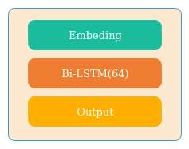
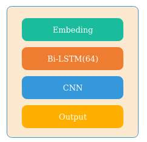
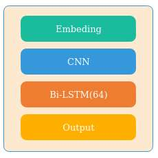
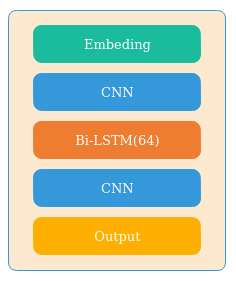
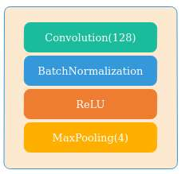
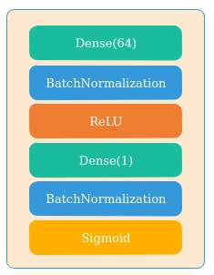

# detect-lstm-model

## URL
|  Model  |  Accuracy  |  Precision  |  Recall  |  F1 Score  | Time per Epoch  |
|  -----  |  :-----:  |  :----:  |  :----:  |  :----:  |  :----:  |
| Bi-LSTM              |  99.51%  |  99.54%  |  99.81%  |  99.67%  |  1242ms  |
| Bi-LSTM + CNN        |  99.78%  |  99.73%  |  99.97%  |  99.86%  |  1185ms  |
| CNN + Bi-LSTM        |  99.60%  |  99.75%  |  99.72%  |  99.73%  |  326ms  |
| CNN + Bi-LSTM + CNN  |  99.54%  |  99.75%  |  99.64%  |  99.69%  |  318ms  |

## Request
|  Model  |  Accuracy  |  Precision  |  Recall  |  F1 Score  | Time per Epoch  |
|  -----  |  :-----:  |  :----:  |  :----:  |  :----:  |  :----:  |
| Bi-LSTM              |  82.30%  |  80.81%  |  99.93%  |  89.23%  |  4434ms  |
| Bi-LSTM + CNN        |  99.11%  |  99.06%  |  99.68%  |  99.36%  |  4406ms  |
| CNN + Bi-LSTM        |  99.10%  |  98.92%  |  99.79%  |  99.35%  |  1101ms  |
| CNN + Bi-LSTM + CNN  |  99.45%  |  99.24%  |  99.96%  |  99.60%  |  1124ms  |

## Architecture

### Bi-LSTM

### Bi-LSTM + CNN

### CNN + Bi-LSTM

### CNN + Bi-LSTM + CNN

## General Architecture

### Input Layer
character embedding √

word embedding ×

### CNN Layer

### Output Layer

